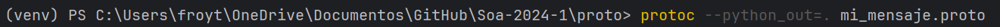

primero creamos el entorno virtual y lo activamos

luego instalamos con el comando pip install -r requirements.txt
el archivo txt se bajo del repo del profe

luego se bajaron 2 archivos de ecal eclipse un whl y un exe para instalarlos de la siguiente url : 
https://eclipse-ecal.github.io/ecal/_download_archive/download_archive.html

se instala el exe

y despues con pip install <direccion del whl>

se instalo el otro archivo

y se ejecuta dentro de la carpeta que contiene el archivo

protoc --python_out=. mi_mensaje.proto

genera un archivo, lo cambiamos de carpeta y lo modificamos quitandole proto o python
